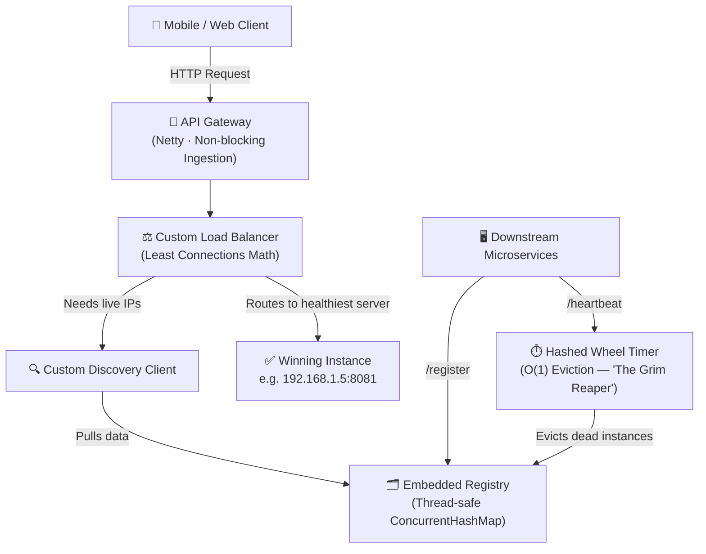

<div align="center">

# ⚡ Hyper-Reactive API Gateway

### A Zero-Dependency, Self-Healing API Gateway with a Built-In Service Registry & Smart Load Balancer

*Enterprise-grade traffic routing — without the enterprise infrastructure bill.*

</div>

---

## 🎯 The 30-Second Pitch

Every company running microservices — Netflix, Uber, Amazon — needs a "traffic cop" that knows which servers are alive and routes users to the healthiest one. Normally, that requires bolting on expensive, heavyweight third-party infrastructure (Netflix Eureka, HashiCorp Consul) just to answer one question: *"who's online right now?"*

**This project answers that question in-house**, with zero external dependencies, sub-second failure detection, and traffic-routing math borrowed from the same engineering playbook used inside Netty and Akka — two of the systems that power a large chunk of the internet's backend traffic today.

It's not a toy CRUD app. It's core distributed-systems infrastructure — the kind of component that determines whether a startup's product survives its first traffic spike.

---

## 💡 Why This Matters for a Startup

| Problem Most Startups Hit | How This Gateway Solves It |
|---|---|
| Paying for (or self-hosting) Consul/Eureka just for service discovery | **Built-in registry** — no extra services, no extra infra cost |
| One server gets slammed while another sits idle (default "round robin" routing) | **Least-Connections routing** — always sends traffic to the least-busy server |
| Crashed servers keep receiving traffic until someone notices | **Self-healing in real time** — dead instances are evicted automatically within seconds |
| Monitoring 1,000s of servers for crashes tanks CPU performance | **O(1) eviction**, regardless of whether you're running 10 servers or 60,000 |
| Engineers spend weeks wiring up off-the-shelf infra before writing product code | **One Spring Boot service, `mvn spring-boot:run`, and you're routing traffic** |

In short: this is the kind of unglamorous, foundational infrastructure that most engineers *use* but very few know how to *build*. Building it from scratch demonstrates the ability to make sound architectural calls under real constraints — exactly what a small, fast-moving founding team needs from an early engineering hire.

---

## 🏗️ How It Works (In Plain English, With the Technical Depth Underneath)

### 1. The Embedded Registry — "No External Dependencies"
Instead of asking another company's server "who's online?", the Gateway keeps its own real-time, thread-safe map of every active microservice in memory. Services check in with a `/register` call and stay alive by sending a `/heartbeat` every few seconds — like a pulse check.

**Under the hood:** a deeply nested, thread-safe `ConcurrentHashMap`, safe for thousands of simultaneous reads/writes without locking up the system.

### 2. The "Grim Reaper" — O(1) Failure Detection at Any Scale
This is the centerpiece of the project. When a server crashes and stops sending its pulse, it needs to be removed from rotation *immediately* — otherwise real users get routed to a dead server.

The naive approach — checking every single server, every second, to see who's still alive — completely falls apart at scale. Check 60,000 servers every second, and you've built a CPU-melting bottleneck instead of a gateway.

**The solution:** a custom-built **Hashed Wheel Timer** — the same algorithmic pattern that powers Netty and Akka, two of the most battle-tested networking frameworks in the industry.

Think of it like a **60-slot Ferris wheel**. Every heartbeat books a seat a few seconds into the future. A single background thread rotates the wheel forward one slot per second, and only evicts the handful of services scheduled for *that exact* slot — never scanning the whole list.

> **The result:** dead-server detection that costs the same, whether you have 10 microservices or 60,000. That's the difference between infrastructure that scales with a startup and infrastructure that becomes next year's rewrite project.

### 3. Smart Load Balancing — Not All Servers Are Equal
Most default gateway setups split traffic 50/50 across servers ("Round Robin") — which is fine until you have one big server next to a smaller one, and the small one falls over.

This Gateway makes routing decisions using **live data**, not blind guesses:
- **Least Connections** — routes each new user to whichever server is currently doing the least work
- **Weighted Round Robin** — understands that a bigger server can handle proportionally more traffic than a smaller one

### 4. A Bridge Into the Industry-Standard Ecosystem
Rather than reinventing everything, the custom registry plugs directly into Spring Cloud's standard interfaces — meaning it's a drop-in replacement for expensive off-the-shelf tools, not a walled-off science project.

---

## 🧠 System Architecture



---

## 🛠️ Tech Stack & Concepts Demonstrated

| Category | Details |
|---|---|
| **Language** | Java 17 / 21 |
| **Framework** | Spring Boot 3.x, Spring Cloud Gateway |
| **Reactive Programming** | Project Reactor (`Mono` / `Flux`), fully non-blocking I/O |
| **Concurrency** | `ConcurrentHashMap`, `AtomicInteger`, volatile fields, thread-safe queues |
| **Algorithmic Design** | Hashed Wheel Timers, lazy cancellation, modulo-based time scheduling |
| **Systems Thinking** | Built to replace infrastructure most teams pay for or self-host |

---

## 🚀 Getting Started

### Prerequisites
- Java 17+
- Maven

### Installation

```bash
# Clone the repository
git clone https://github.com/SONAI-07/Hyper-Reactive-API-Gateway.git

# Build the project
mvn clean install

# Run the Gateway
mvn spring-boot:run
```

### Try It Yourself — Register a Mock Service

```bash
curl -X POST http://localhost:8080/register \
-H "Content-Type: application/json" \
-d '{
  "serviceId": "order-service",
  "instanceId": "order-service-node-1",
  "host": "127.0.0.1",
  "port": 8081,
  "weight": 5,
  "activeConnections": 12
}'
```

> ⚠️ Hit `/heartbeat` within 90 seconds — or the Hashed Wheel Timer will evict your service, right on schedule.

---

## 🔮 Roadmap

- [ ] **Global Pre-Filters** — JWT authentication, blocking unauthorized traffic before it hits the load balancer
- [ ] **Global Post-Filters** — centralized latency logging and sensitive header stripping
- [ ] **Circuit Breaking** — Resilience4J integration to short-circuit requests when a downstream service degrades

---

